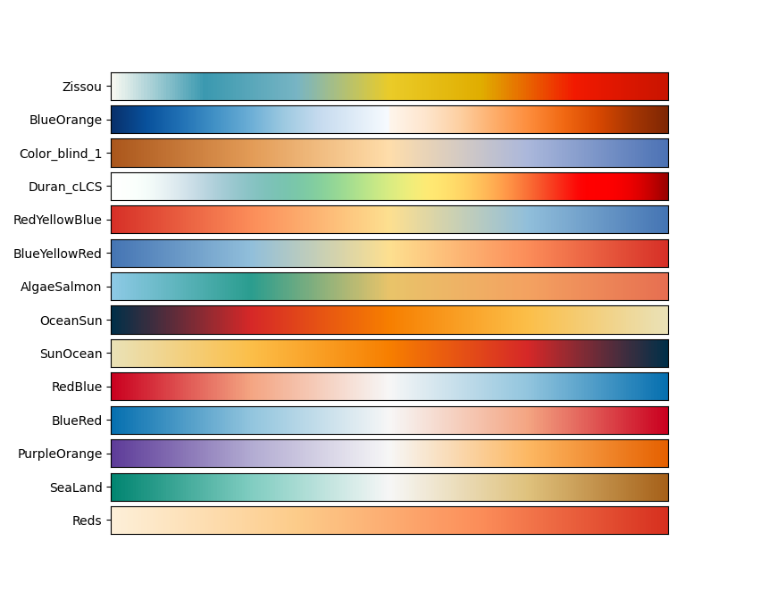

[](https://doi.org/10.5281/zenodo.10574263)
# cLCS
Climatological Lagrangian Coherent Structure calculation using python based on the code developed by Rodrigo Duran for [Matlab](https://bitbucket.org/rodu/clcss/src/master/). 

- [cLCS](#clcs)
  - [Description](#description)
  - [Conda Installation](#conda-installation)
  - [Docker Image](#docker-image)
  - [Contents](#contents)
    - [cLCS](#clcs-1)
    - [Examples](#examples)
  - [References](#references)
  - [Additional info](#additional-info)
      - [Personalised colourmap options ](#personalised-colourmap-options-)


## Description
This repository contains the scripts needed to deploy a series of particle releases using OpenDrift and calculate the  associated climatological Lagrangian Coherent Structures. The user can define a variety of parameters, for more information see the [jupyter notebook example](https://github.com/MireyaMMO/cLCS/blob/main/examples/01_cLCS_complete_run.ipynb). Support of quad-triangular unstructured grids such as SCHISM outputs is being tested. The main objective of this repository is to calculate climatological LCSs, however options are provided if the user is interested in calculating non-climatological LCSs.


## Conda Installation
To use this package OpenDrift is necessary. To facilitate and make the installation faster please use [mamba](https://github.com/conda-forge/miniforge). 
Example of how to install on Unix-like platforms (Mac OS & Linux):
```
curl -L -O "https://github.com/conda-forge/miniforge/releases/latest/download/Miniforge3-$(uname)-$(uname -m).sh

bash Miniforge3-$(uname)-$(uname -m).sh
```
*Accessed: December 2023

Once mamba is installed we can proceed.

This research was part of the [Moana Project](www.moanaproject.org), therefore the reader used for OpenDrift is especific to a reader developed by [Simon Weppe](https://github.com/simonweppe) for the project use. However, unless working with the same dataset or a data related to the Moana project I invite you to download the repository directly from OpenDrift

OpenDrift original repo
```
git clone https://github.com/OpenDrift/opendrift.git
```

Branch developed by Simon Weppe
```
git clone https://github.com/simonweppe/opendrift.git
```

The [environment.yml](https://github.com/MireyaMMO/cLCS/blob/main/environment.yml) file contains all the dependencies needed to run opendrift and cLCS scripts.
```
cd ../
git clone https://github.com/MireyaMMO/cLCS.git 
cd cLCS
mamba env create --name cLCS --file=environment.yml
pip install -e .
cd ../opendrift
pip install -e .
```

## Docker Image
To build a local docker image:
```
docker build -f Dockerfile -t clcs:$tag .
```

To pull a working docker image from the current repository

Moana Version (developed by Simon Weppe)
```
docker pull mmontao/clcs:MOANA-v1.0.0   
```
OpenDrift
```
docker pull mmontao/clcs:v1.0.0   
```

And run. $tag can be v1.0.0, MOANA-v1.0.0 or if built locally the chosen tag
```
docker run -ti mmontao/clcs:$tag bash
```

## Contents
### [cLCS](https://github.com/MireyaMMO/cLCS/tree/main/cLCS)
  - [mean_C.py](https://github.com/MireyaMMO/cLCS/blob/main/cLCS/mean_C.py) contains the [mean_CG](https://github.com/MireyaMMO/cLCS/blob/cc9eafca4116e073e67fece8c685dc00c995b066/cLCS/mean_C.py#L23C7-L23C13) class that deploys particles throughout the grid using OpenDrift and computes monthly averages Cauchy-Green tensors for a defined month (See Duran, et al., 2018 for more details on the methods).
  - [make_cLCS.py](https://github.com/MireyaMMO/cLCS/blob/main/cLCS/make_cLCS.py) contains the class [compute_cLCS_squeezelines](https://github.com/MireyaMMO/cLCS/blob/cc9eafca4116e073e67fece8c685dc00c995b066/cLCS/make_cLCS.py#L7C7-L7C7) which uses the provided Cauchy-Green tensors obtained from mean_CG to compute the squeezelines associated to cLCS. 
  - [plotting_cLCS.py](https://github.com/MireyaMMO/cLCS/blob/main/cLCS/plotting.py) using the squeezelines obtained from compute_cLCS_squeezeline `plotting_cLCS` can help to visualise the resulting cLCS using cartopy.  `cLCSrho_cartopy_colour` to plot the cLCS and the strength associated to them represented by a colourmap. `cLCSrho_cartopy_monochrome` to visualise the cLCS in one colour.
  - [utils.py](https://github.com/MireyaMMO/cLCS/blob/main/cLCS/utils.py) contains some utility functions used accross the different classes such as `sp2xy`,  `xy2sph` and `get_colourmap`. The latter contains [personalised colourmap options ](#personalised-colourmap-options-) for a different variety of colourmaps (see Additional info). 

### [Examples](https://github.com/MireyaMMO/cLCS/tree/main/examples)
  - [01_cLCS_ROMS.ipynb](https://github.com/MireyaMMO/cLCS/blob/main/examples/01_cLCS_ROMS.ipynb) This jupyter notebook displays an example of how to compute the cLCS calculation using the data from the thesis referenced below. 
  - [02_LCS_SCHISM.ipynb](https://github.com/MireyaMMO/cLCS/blob/main/examples/02_LCS_SCHISM.ipynb) This jupyter notebook displays an example of how to compute the LCS calculation using an unstructured-hydrodynamic model (SCHISM) and a wave model. 
  - [03_LCS_SCHISM_stokes_only.ipynb](https://github.com/MireyaMMO/cLCS/blob/main/examples/03_LCS_SCHISM_stokes_only.ipynb) This jupyter notebook displays an example of how to compute the LCS calculation only considering stokes drift. 

## References
**cLCS description and matlab toolbox**

[Duran, R., Beron-Vera, F.J. & Olascoaga, M.J. Extracting quasi-steady Lagrangian transport patterns from the ocean circulation: An application to the Gulf of Mexico. Sci Rep 8, 5218 (2018). https://doi.org/10.1038/s41598-018-23121-y](https://www.nature.com/articles/s41598-018-23121-y)

[Duran, R., F. J. Beron-Vera and M. J. Olascoaga (2019). Climatologial Lagrangian Coherent Structures code. DOI: 10.18141/1558781](https://bitbucket.org/rodu/clcss/src/master/)

**OpenDrift**

[Dagestad, K.-F., Rohrs, J., Breivik, O., and Ådlandsvik, B. (2018). OpenDrift v1.0: a generic framework for trajectory modelling. Geoscientific Model Development, 11 (4), 1405–1420.](https://github.com/OpenDrift/opendrift)

**Moana Project - BoP Study**

Montano Orozco, M. M. (2023). Hydrodynamics and coastal dispersion from the Bay of Plenty, Aotearoa, New Zealand: A 25-year numerical modelling perspective (Thesis, Doctor of Philosophy). University of Otago. Retrieved from http://hdl.handle.net/10523/16243. 

[For a better formatted version of the thesis (working embedded links) please click here](https://drive.google.com/file/d/1WMgq2lu7K5MjGTy6O5YpoKDkONDclkHo/view?usp=sharing)

Moana Project [THREDDS](http://thredds.moanaproject.org:6443/thredds/catalog/moana/catalog.html) 


## Additional info
#### Personalised colourmap options 